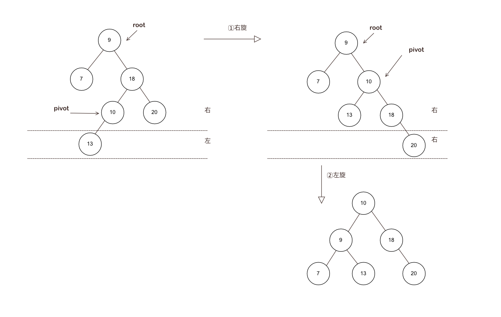

### 红黑树详解

来看看，红黑树的广泛的应用

    JDK 1.8开始，HashMap也引入了红黑树：当冲突的链表长度超过8时，自动转为红黑树
    Java中，TreeMap、TreeSet都使用红黑树作为底层数据结构
    Linux底层的CFS进程调度算法中，vruntime使用红黑树进行存储。
    多路复用技术的Epoll，其核心结构是红黑树 + 双向链表。

面试过程中，HashMap 常常是面试的重点， 而且会以连环炮 的方式进行发问，

所以， 红黑树基本是 面试必须的 要点， 如果 答不上来，面试就有 很大程度 就黄了。

红黑树，又比较复杂，有非常多的场景, 大家记住不容易。

本文，尼恩帮大家做了 彻底，形象的梳理， 帮助大家 轻松 记住 红黑树。

---

### BST二叉查找树
#### 二叉查找树（BST）具备以下特性：
1. 左子树上所有结点的值均小于或等于它的根结点的值。
2. 右子树上所有结点的值均大于或等于它的根结点的值。
3. 左、右子树也分别为二叉排序树。

#### 二叉搜索树 BST的完美情况

一般人们理解的二叉树（又叫二叉搜索树 BST）会出现一个问题，完美的情况下，它是这样的：

#### 二叉搜索树的查找流程
如何查找值为7的节点？

1. 查看根节点8，因为7<8，所以再查看它的左子节点6
2. 查看左子节点6，因为7>6，所以再查看它的右子节点7
3. 查看右子节点7，因为7=7，所以就找到啦

#### 二叉搜索树的极端情况

二叉查找树是有缺点的，在不断插入的时候，**有可能出现这样一种情况**：很容易“退化”成链表，

如果bst 树的节点正好从大到小的插入，此时树的结构也类似于链表结构，这时候的查询或写入耗时与链表相同。

##### 退化成为了 链表的特殊BST


它和链表一样，搜索的时候，最坏情况的时间复杂度O(n) 。

#### 那么我们怎么避免这种情况呢？

为了避免这种特殊的情况发生，引入了平衡二叉树（AVL）和红黑树（red-black tree）。

AVL 、rbt 都是通过本身的建树原则来控制树的层数和节点位置，

因为rbtree是由AVL演变而来，所以我们从了解AVL开始。

---

### AVL平衡二叉树

平衡二叉树也叫AVL（发明者名字简写），也属于二叉搜索树的一种，与其不同的是AVL通过机制保证其自身的平衡。

> AVL树是最先发明的自平衡二叉查找树。 
> 在AVL树中任何节点的两个子树的高度最大差别为1，所以它也被称为高度平衡树。
> 增加和删除可能需要通过一次或多次树旋转来重新平衡这个树。

---

#### AVL树的特性

1. **特性1**： 对于任何一颗子树的root根结点而言，它的左子树任何节点的key一定比root小，而右子树任何节点的key 一定比root大；
2. **特性2**：对于AVL树而言，其中任何子树仍然是AVL树；
3. **特性3**：每个节点的左右子节点的高度之差的绝对值最多为1；


    特性1表明，AVL 继承于 BST , 所以:

    1.AVL本身首先是一棵BST 二叉搜索树。
    2.AVL带有平衡条件：每个结点的左右子树的高度之差的绝对值（平衡因子）最多为1。

- 在插入、删除树节点的时候，如果破坏了以上的原则，AVL树会自动进行调整使得以上三条原则仍然成立。 也就是说，AVL树，本质上是带了平衡功能的二叉查找树（二叉排序树，二叉搜索树）。

#### AVL树的平衡功能

- **举个例子**，下左图为AVL树最长的2节点与最短的8节点高度差为1；

- 当插入一个新的节点后，根据上面第一条原则，它会出现在2节点的左子树，但这样一来就违反了原则3。

```
      5            5
     / \          / \
    4   8   →    4   8
   /            /      
  2            2         
              /           
             1             
```
此时AVL树会通过节点的旋转进行进行平衡，

AVL调整的过程称之为左旋和右旋，

#### AVL平衡的调整过程

- 旋转之前，首先确定旋转支点（pivot）： 这个旋转支点就是失去平衡这部分树，在自平衡之后的根节点，

- 平衡的调整过程，需要根据pivot它来进行旋转。

- 我们在学习AVL树的旋转时，不要将失衡问题扩大到整个树来看，这样会扰乱你的思路，

- 我们只关注失衡子树的根结点 及它的子节点和孙子节点即可。

- 事实上，AVL树的旋转，我们权且叫“AVL旋转”是有规律可循的，因为只要聚焦到失衡子树，然后进行左旋、右旋即可。


    很多人在左旋和右旋有时候弄不明白，
    其实左旋就是逆时针转，右旋是顺时针转

#### AVL子树失衡的四大场景

导致AVL失衡的场景就是有限的4个：

1. 左左结构失衡（LL型失衡）
2. 右右结构失衡（RR型失衡）
3. 左右结构失衡（LR型失衡）
4. 右左结构失衡（RL型失衡）

删除元素，也会导致AVL失衡，需要再平衡，但是原理和插入元素是类似的。
这里聚焦 介绍插入元素的平衡过程， 删除元素，不做介绍。

##### 场景1: LL型失衡-左左结构失衡（右旋）：


    场景： 插入的元素在子树root的左侧不平衡元素的左侧
    此时，以root的左儿为支点，也就是，左侧的不平衡元素为pivot(支点), 进行右旋


来一个右旋的动画：


    右旋过程中，如果pivot有右子树，则作为 原root的 左子树， 保障AVL的特性1

- **记忆要点:** 尼恩备注记忆要点，LL型失衡怎么 平衡呢？


    旋转的反向，与失衡的方向相反， LL 型失衡，与左边 相反的方向， 是右边，所以是右旋


##### 场景2 RR型失衡：右右结构失衡（左旋）


    场景：插入的元素在子树root右侧的不平衡子树的右侧
    此时，以root的右儿为支点，也就是，右侧的不平衡元素 为 pivot(支点)， 进行左旋


来一个左旋的动画：


    左旋过程中，如果pivot有左子树，则作为 原root的 右子树，保障AVL的特性1，


- **记忆要点:** 尼恩备注记忆要点，RR型失衡怎么 平衡呢？


    旋转的反向，与失衡的方向相反，RR 型失衡，与右边 相反的方向， 是左边，所以是左旋


##### 场景3 LR型失衡：左右结构失衡（左旋+右旋）

    场景： 插入的元素在左侧的不平衡元素的右侧


- **记忆要点:** 尼恩备注记忆要点，LR型失衡怎么 平衡呢？


    旋转的反向，与失衡的方向相反，先旋转底部，再旋转顶部


##### 场景4 RL失衡: 右左结构 （右旋+左旋）





- **记忆要点:** 尼恩备注记忆要点，RL型失衡怎么 平衡呢？


    旋转的反向，与失衡的方向相反，先旋转底部，再旋转顶部

#### AVL树平衡总结


对于左右结构和右左结构无非是经过多次旋转达到稳定，旋转的方式并没有区别，

AVL树本质上还是一棵二叉搜索树，它有以下特性：
1. 本身首先是一棵二叉搜索树。
2. 带有平衡条件：每个结点的左右子树的高度之差的绝对值（平衡因子）最多为1。

#### AVL树的删除

删除的判断标准

- 要删除的节点是什么类型的节点？；
- 删除后是否会破坏平衡 ；

节点类型

- 叶子节点；
- 节点只有左子树或只有右子树 ；
- 既有左右子树都有。

处理的思路

- 当删除为叶子节点，则直接删除，并从父亲节点开始往上看，判断是否失衡；如果没有失衡，再判断父亲的父节点是否失衡，直到根节点。若失衡则判断失衡类型（LL、LR、RR、RL），再进行相应的调整。
- 删除的节点只有左子树或只有右子树，那么将节点删除，以左子树或右子树进行代替，并进行相应的平衡判断，若失衡则调整，一直到根节点 ；
- 删除的节点既有左子树又有右子树，找到其前驱或者后驱节点将其替换，再判断是否失衡，然后根据失衡情况调整，直到根节点。

#### 常见AVL面试题

##### 问：什么是AVL左旋和右旋？

    加入节点后，左旋和右旋 ，维护AVL平衡性

- **右旋转** 场景： 插入的元素在不平衡元素的左侧的左侧
- **左旋转** 场景： 插入的元素在不平衡元素的右侧的右侧

##### 问：既然AVL树可以保证二叉树的平衡，这就意味着AVL搜索的时候，它最坏情况的时间复杂度O(logn) ，要低于普通二叉树BST和链表的最坏情况O(n)。那么HashMap直接使用AVL树来替换链表就好了，为什么选择用红黑树呢？

**原因是：** 由于AVL树必须保证左右子树平衡，Max(最大树高-最小树高) <= 1，
所以在插入的时候很容易出现不平衡的情况，一旦这样，就需要进行旋转以求达到平衡。
正是由于这种严格的平衡条件，导致AVL需要花大量时间在调整上，故AVL树一般使用场景在于**查询场景**， 而不是 **增加删除** 频繁的场景。

##### 问：红黑树(rbt)做了什么优化呢？

红黑树(rbt)继承了AVL可自平衡的优点， 同时, 红黑树(rbt)在**查询速率和平衡调整**中寻找平衡，放宽了树的平衡条件，从而可以用于 **增加删除** 频繁的场景。 在实际应用中，红黑树的使用要多得多。

### 红黑树（RBTree）

- 红黑树是一种特化的AVL树（平衡二叉树）
- 红黑树是在1972年由Rudolf Bayer发明的，当时被称为平衡二叉B树（symmetric binary B-trees）.
- 在1978年被 Leo J. Guibas 和 Robert Sedgewick 修改为如今的“红黑树”.

#### 什么是红黑树？

1. 红黑树也是一种自平衡二叉查找树，它与AVL树类似，都在添加和删除的时候通过旋转操作保持二叉树的平衡，以求更高效的查询性能。
2. 与AVL树相比，红黑树牺牲了部分平衡性，以换取插入/删除操作时较少的旋转操作，整体来说性能要优于AVL树。
3. 虽然RBTree是复杂的, 但它的最坏情况运行时间也是非常良好的,并且在实践中是高效的：


    它可以在O(log n)时间内做查找,插入和删除,这里的n 是树中元素的数目.

#### 红黑树的特性

红黑树是实际应用中最常用的平衡二叉查找树，它不严格的具有平衡属性，但平均的使用性能非常良好。

在红黑树中，节点被标记为红色和黑色两种颜色。

红黑树的原则有以下几点：

- 特性1：节点非黑即红
- 特性2：根节点一定是黑色
- 特性3：叶子节点（NIL）一定是黑色
- 特性4：每个红色节点的两个子节点都为黑色。(从每个叶子到根的所有路径上不能有两个连续的红色节点)
- 特性5：从任一节点到其每个叶子的所有路径，都包含相同数目的黑色节点。

**红色属性** 说明，红色节点的孩子，一定是黑色。 但是，RBTree 黑色节点的孩子，可以是红色，也可以是黑色，具体如下图。

**叶子属性** 说明， 叶子节点可以是空nil ，AVL的叶子节点不是空的，具体如下图。


基于上面的原则，我们一般在插入红黑树节点的时候，会将这个节点设置为**红色**，

原因参照最后一条原则： **红色破坏原则的可能性最小**，如果是黑色, 很可能**导致这条支路的黑色节点比其它支路的要多1**，破坏了平衡。

黑色属性，可以理解为**平衡特征**， 如果满足不了平衡特征，就要进行平衡操作。

**空间换时间**,RBT有点属于一种空间换时间类型的优化，
在avl的节点上，增加了 **颜色属性的数据**，相当于 增加了空间的消耗。 通过颜色属性的增加， 换取，后面平衡操作的次数减少。

#### 黑色完美平衡

红黑树并不是一颗**AVL平衡二叉搜索树**，从图上可以看到，根节点P的左子树显然比右子树高

根据 红黑树的特性5，从任一节点到其每个叶子的所有路径，都包含相同数目的黑色节点， 说明：

    rbt 的 左子树和右子树的黑节点的层数是相等的
    红黑树的平衡条件，不是以整体的高度来约束的，而是以黑色 节点的 高度，来约束的。

所以称红黑树这种平衡为**黑色完美平衡**。


看看黑色完美平衡的效果，

去掉 rbt中的红色节点，会得到 一个四叉树， 从根节点到每一个叶子，高度相同，就是rbt的root到叶子的黑色路径长度。


#### 红黑树的恢复平衡过程的三个操作

一旦红黑树5个原则有不满足的情况，我们视为平衡被打破，如何 恢复平衡？

靠它的三种操作：**变色、左旋、右旋**。

1. 变色


    节点的颜色由红变黑或由黑变红。（这个操作很好了解）

2. 左旋

以某个结点作为支点(pivot)，其父节点（子树的root）旋转为自己的左子树（左旋），pivot的原左子树变成 原root节点的 右子树，pivot的原右子树保持不变。


   
   

3. 右旋：

以某个结点作为支点(pivot)，其父节点（子树的root）旋转为自己的右子树（右旋），pivot的原右子树变成 原root节点的 左子树，pivot的原左子树保持不变。


红黑树的左旋、右旋操作，AVL树的左旋，右旋操作 差不多


#### 红黑树插入节点情景分析

##### 红黑树的节点结构

以HashMap中的红黑树的结构定义为例子：

```java

    static class Node<K,V> implements Map.Entry<K,V> {
            final int hash;
            final K key;
            volatile V val;
            volatile Node<K,V> next;
    }
     
     
    /**
     * Nodes for use in TreeBins
     */
    static final class TreeNode<K,V> extends Node<K,V> {
        TreeNode<K,V> parent;  // red-black tree links
        TreeNode<K,V> left;
        TreeNode<K,V> right;
        TreeNode<K,V> prev;    // needed to unlink next upon deletion
        boolean red;
     
        TreeNode(int hash, K key, V val, Node<K,V> next,
                 TreeNode<K,V> parent) {
            super(hash, key, val, next);
            this.parent = parent;
        }
    }

```
**默认新插入的节点为红色：** 因为父节点为黑色的概率较大，插入新节点为红色，可以避免颜色冲突

##### 场景1：红黑树为空树

直接把插入结点作为根节点就可以了 

另外：根据红黑树性质 2根节点是黑色的。还需要把插入节点设置为黑色。

##### 场景2：插入节点的Key已经存在

更新当前节点的值，为插入节点的值。


##### 场景3：插入节点的父节点为黑色

由于插入的节点是红色的，当插入节点的父节点是黑色时，不会影响红黑树的平衡，

所以： **直接插入无需做自平衡**。


##### 场景4：插入节点的父节点为红色

**根据性质2：** 根节点是黑色。

如果插入节点的父节点为红色节点，那么该父节点不可能为根节点，所以插入节点总是存在祖父节点(三代关系)。

**根据性质4：** 每个红色节点的两个子节点一定是黑色的。不能有两个红色节点相连。

此时会出现两种状态：

- 父亲和叔叔为红色

- 父亲为红色，叔叔为黑色


##### 场景4.1：父亲和叔叔为红色节点

根据性质4：**红色节点不能相连 ==》祖父节点肯定为黑色节点：**

父亲为红色，那么此时该插入子树的红黑树层数的情况是：黑红红。

因为不可能同时存在两个相连的红色节点，需要进行 变色， 显然处理方式是把其改为：红黑红

**变色** 处理：黑红红 ==> 红黑红

1. 将F和V节点改为黑色

2. 将P改为红色

3. 将P设置为当前节点，进行后续处理


可以看到，将P设置为红色了，

- 如果P的父节点是黑色，那么无需做处理；
- 但如果P的父节点是红色，则违反红黑树性质了，所以需要将P设置为当前节点，继续插入操作, 作自平衡处理，直到整体平衡为止。

##### 场景4.2：叔叔为黑色，父亲为红色，并且插在父亲的左节点

叔叔为黑色，或者不存在（NIL）也是黑节点，并且节点的父亲节点是祖父节点的左子节点

注意：单纯从插入来看，叔叔节点非红即黑(NIL节点)，否则破坏了红黑树性质5，此时路径会比其他路径多一个黑色节点。


##### 场景4.2.1 LL型失衡

**细分场景 1：** 新插入节点，为其父节点的左子节点(LL红色情况)， 插入后 就是LL 型失衡


自平衡处理：

1. 变颜色： 将F设置为黑色，将P设置为红色

2. 对F节点进行右旋


##### 场景4.2.2 LR型失衡

**细分场景 2：** 新插入节点，为其父节点的右子节点(LR红色情况)， 插入后 就是LR 型失衡


自平衡处理：

1. 对F进行左旋
2. 将F设置为当前节点，得到LL红色情况
3. 按照LL红色情况处理(1.变色 2.右旋P节点)


##### 情景4.3：叔叔为黑节点，父亲为红色，并且父亲节点是祖父节点的右子节点


##### 情景4.3.1：RR型失衡

新插入节点，为其父节点的右子节点(RR红色情况)


自平衡处理：

1. 变色：将F设置为黑色，将P设置为红色
2. 对P节点进行左旋


##### 情景4.3.2：RL型失衡

新插入节点，为其父节点的左子节点(RL红色情况)


自平衡处理：

1. 对F进行右旋
2. 将F设置为当前节点，得到RR红色情况
3. 按照RR红色情况处理(1.变色 2.左旋 P节点)


#### RBT面试题：

**问：有了二叉搜索树，为什么还需要平衡二叉树？**

二叉搜索树容易退化成一条链,这时，查找的时间复杂度从O ( log n）也将退化成O ( N )

引入对左右子树高度差有限制的平衡二叉树 AVL，保证查找操作的最坏时间复杂度也为O ( log n）
问：有了平衡二叉树，为什么还需要红黑树？

AVL的左右子树高度差不能超过1，每次进行插入/删除操作时，几乎都需要通过旋转操作保持平衡

在频繁进行插入/删除的场景中，频繁的旋转操作使得AVL的性能大打折扣

红黑树通过牺牲严格的平衡，换取插入/删除时少量的旋转操作，

整体性能优于AVL

- 红黑树插入时的不平衡，不超过两次旋转就可以解决；删除时的不平衡，不超过三次旋转就能解决
- 红黑树的红黑规则，保证最坏的情况下，也能在O ( log n）时间内完成查找操作。

**问：红黑树那几个原则，你还记得么？**

可以按照括号里边的分类，记住 红黑树的几个原则：

    （颜色属性）节点非黑即红
    （根属性）根节点一定是黑色
    （叶子属性）叶子节点（NIL）一定是黑色
    （红色属性）每个红色节点的两个子节点，都为黑色。(从每个叶子到根的所有路径上不能有两个连续的红色节点)
    （黑色属性）从任一节点到其每个叶子的所有路径，都包含相同数目的黑色节点。

**问：红黑树写入操作 ，是如何找到它的父节点的?**

红黑树的节点 TreeNode它就是继承Node结构，先看看红黑树的节点结构

以HashMap中的红黑树的结构定义为例子：

```java

      static class Node<K,V> implements Map.Entry<K,V> {
            final int hash;
            final K key;
            volatile V val;
            volatile Node<K,V> next;
      }
     
     
    /**
     * Nodes for use in TreeBins
     */
    static final class TreeNode<K,V> extends Node<K,V> {
        TreeNode<K, V> parent;  // red-black tree links
        TreeNode<K, V> left;
        TreeNode<K, V> right;
        TreeNode<K, V> prev;    // needed to unlink next upon deletion
        boolean red;

        TreeNode(int hash, K key, V val, Node<K, V> next,
                 TreeNode<K, V> parent) {
            super(hash, key, val, next);
            this.parent = parent;
        }
    }
```
TreeNode在Node基础上加了几个字段，分别指向父节点parent，然后指向左子节点left，还有指向右子节点的right， 然后还有表示颜色red属性

**问：红黑树的有那些内部操作**

变色 :把一个红色的节点变成黑色，或者把一个黑色的节点变成红色，就是对这个节点的变色。

旋转 :与平衡二叉树的旋转操作类似。

**红黑树与AVL树区别**

**1、调整平衡的实现机制不同**

红黑树根据路径上黑色节点数目一致，来确定是否失衡，如果失衡，就通过变色和旋转来恢复

AVL根据树的平衡因子(所有节点的左右子树高度差的绝对值不超过1)，来确定是否失衡，如果失衡，就通过旋转来恢复

**2、红黑树的插入效率更高**

红黑树是用非严格的平衡来换取增删节点时候旋转次数的降低，任何不平衡都会在三次旋转之内解决，

红黑树并不追求“完全平衡”，它只要求部分地达到平衡要求，降低了对旋转的要求，从而提高了性能

而AVL是严格平衡树(高度平衡的二叉搜索树)，因此在增加或者删除节点的时候，根据不同情况，旋转的次数比红黑树要多。

所以红黑树的插入效率更高

**3、红黑树统计性能比AVL树更高**

红黑树能够以O(log n) 的时间复杂度进行查询、插入、删除操作。

AVL树查找、插入和删除在平均和最坏情况下都是O(log n)。

红黑树的算法时间复杂度和AVL相同，但统计性能比AVL树更高，

**4、适用性：AVL查找效率高**

如果你的应用中，查询的次数远远大于插入和删除，那么选择AVL树，如果查询和插入删除次数几乎差不多，应选择红黑树。

即，有时仅为了排序（建立-遍历-删除），不查找或查找次数很少，R-B树合算一些。
